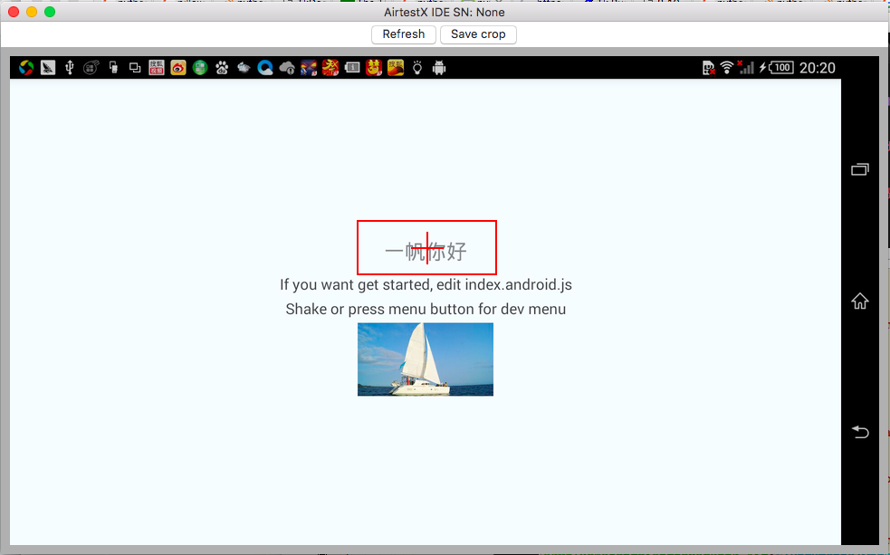
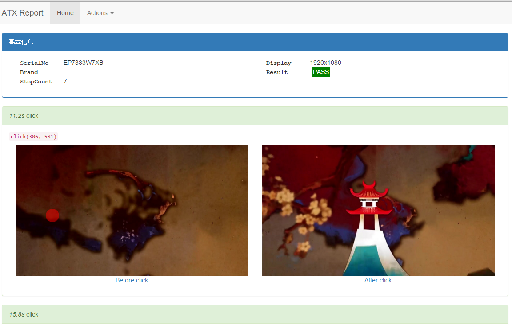

# AutomatorX (atx) (中文版)
[](https://travis-ci.org/codeskyblue/AutomatorX)
[](http://atx.readthedocs.org/en/latest/?badge=latest)
[](https://pypi.python.org/pypi/atx)
[](https://pypi.python.org/pypi/atx)
[]()

该项目是为了让手机应用的一些常规测试可以自动化起来，让测试人员摆脱那些枯燥的重复性工作。
基于OpenCV的图像识别技术，有点类似于SikuliX(这东西挺好用的，只是没说要支持手机端)

ATX is short for _AutomatorX_
## Features
1. 完全的黑盒测试框架，无需知道项目代码，非侵入式
2. 可是很好的支持安卓手机的测试，包括安卓模拟器
3. 支持Windows应用的测试
4. 对于游戏测试，可以使用图像缩放的方法适应不同分辨率的手机

## 历史起源
以前写过一个项目 <https://github.com/netease/airtest>，atx是airtest的重构版本,。
因为原版代码冗余太严重，维护成本太高，所以就新开了一个新的项目。

新版有哪些新的功能呢？

### 与原版主要变化
* 简化安装方式，只需要安装opencv以及通过pip安装atx 无其他依赖
* 支持原生UI元素的查找和点击
* 截图方式重原有缓慢的adb截图，改成默认uiautomator截图，可选minicap截图(1080x1920手机截图平均耗时0.2s）
* 优化图像的自动缩放算法，以便同样的脚本可以适应不同的机器
* 支持Watch用法，可持续监控界面，当某个元素出现时执行特定操作
* 截图客户端从网页服务器变成了python-Tkinter写的客户端 使用python -matx gui启动
* 支持dir(dev) 查看元素已有的方法（-_-! 之前代码写的不好，并不支持）
* 更稳定的依赖库控制，与travis持续集成，可在代码更新后自动发布到pypi
* 移除性能监控功能，暂时移除iOS支持
* 图像匹配默认使用模版匹配，将SIFT匹配改为可选

## Dependency
1. python2.7
2. opencv2.4
3. Android4.1+

## Installation
1. 首先安装opencv(`>=2.4 && <3.0`)到你的电脑上

	windows推荐直接通过pip安装, 根据你是win32还是amd64选择合适的版本，如果pip安装不上，就需要把相应的numpy和opencv下载下来。然后在本地安装 [备用下载地址](https://github.com/NetEase/aircv/releases)
	安装方法很简单，例如 `pip install opencv??.whl`, pip最好版本高一点(>=8.1.0)，避免出错

	```
	# For Win32
	pip install http://7rfh09.com2.z0.glb.qiniucdn.com/opencv_python-2.4.12-cp27-none-win32.whl
	# For AMD64
	pip install http://7rfh09.com2.z0.glb.qiniucdn.com/opencv_python-2.4.12-cp27-none-win_amd64.whl
	```

	如果是Macbook，安装方法要比想象中的简单，然而耗时也比想象中的要长, 先安装`brew`, 之后

	```
	brew install python pillow opencv
	```

2. 安装ATX

	为了编码的时候能少敲一点字母, pip中软件包的名字简化成了 atx

	```
	pip install --upgrade atx
	```

	For the develop version, (maybe not stable), Sync with github master code

	```
	pip install --upgrade --pre atx
	```

	有的时候Pypi会有点抽风, 从源码安装也是可行的

	```
	pip install -U git+https://github.com/codeskyblue/AirtestX.git
	```


3. 安装ADB (Android Debug Bridge)

	下载adb安装到电脑上，推荐下载地址 <http://adbshell.com/>

## Quick start
1. 连接一台安卓手机 (4.1+)

	打开windows命令行，执行 `adb devices`, 请确保看到类似输出, 没有其他的错误

	```bash
	$ adb devices
	List of devices attached
	EP7333W7XB      device
	```

2. 创建一个python文件 `test.py`, 内容如下

	```python
	# coding: utf-8
	import atx

	d = atx.connect() # 如果多个手机连接电脑，则需要填入对应的设备号
	d.screenshot('screen.png') # 截图
	```

	运行 `python test.py`

3. 截图

	命令行运行 `python -matx gui`, 鼠标左键拖拽选择一个按钮或者图标, 按下`Save Cropped`截图保存推出. (按下`Refresh`可以重新刷新屏幕)

	

	_PS: 这里其实有个好的IDE截图的最好了，现在是用Tkinter做的，比较简洁，但是可以跨平台，效果也还可以_

	截图后的文件另存为 `button.png`, `test.py` 最后增加一行 `d.click_image('button.png')`

	重新运行 `python test.py`, 此时差不多可以看到代码可以点击那个按钮了

4. 更多

	可以使用的接口还有很多，请接着往下看

## Examples
ATX毕竟是一个python库，给出代码的例子可能更好理解一些

接口可以参考sphinx自动生成文档
[Documentation on ReadTheDocs](http://atx.readthedocs.org/en/latest/?badge=latest)
文档等下在看，先看一些例子


* 初始化设备的连接

	```py
	import atx

	d = atx.connect()
	```

	通过设置相应的环境变量也可以设置连接参数，用来方便持续集成

	目前支持4个环境变量

	```sh
	ATX_ADB_SERIALNO
	ATX_ADB_HOST
	ATX_ADB_PORT
	ATX_PLATFORM  默认是 android
	```

	```sh
	$ python -c 'import atx; atx.connect("EFF153")'

	# 等价写法
	$ export ATX_ADB_SERIALNO="EFF153"
	$ python -c 'import atx; atx.connect()'
	```

* App的起停

	```py
	package_name = 'com.example.game'

	d.stop_app(package_name)
	# d.stop_app(package_name, clear=True) # stop and remove app data
	d.start_app(package_name)
	```

* 执行Shell命令
	
	```py
	d.adb_cmd(['pull', '/data/local/tmp/hi.txt'])
	d.adb_shell(['uptime'])
	print d.forward(10080) # forward device port to localhost
	# Expect (host, port)
	print d.wlan_ip # 获取手机的Wlan IP
	```

* 图片查找与点击

	```py
	# find image position
	if d.exists('button.png'): # 判断截图是否在屏幕中出现
		print 'founded'

	# take screenshot
	d.screenshot('screen.png') # 保存屏幕截图

	# click position
	d.click(50, 100) # 模拟点击 x, y
	
	# click offset image
	d.click_image(atx.Pattern('button.png', offset=(100, 20))) # 带有偏移量的点击

	# 指定截图时手机的分辨率是 1920x1080 以便脚本运行在其他分辨率的手机上时可以自动适应
	d.click_image(atx.Pattern('button.png', rsl=(1080, 1920))) 

	# if image not show in 10s, ImageNotFoundError will raised
	try:
		d.click_image('button.png', timeout=10.0)
	except atx.ImageNotFoundError:
		print('Image not found')

	# 在特定的区域内查找匹配的图像(IDE暂时还不支持如此高级的操作)
	nd = d.region(atx.Bounds(50, 50, 180, 300))
	print nd.match('folder.png')
	```

* 原生UI操作

	如何点击UI元素请直接看 <https://github.com/codeskyblue/airtest-uiautomator>
	里面的API是直接通过继承的方式支持的。

	```py
	# click by UI component
	d(text='Enter').click()
	```

* 文本的输入

	```py
	d.type("hello world")
	d.type("atx", enter=True) # perform enter after input
	```

* 常用配置
	
	```py
	# 配置截图图片的手机分辨率
	d.resolution = (1920, 1080)
	print d.resolution
	# expect output: (1080, 1920) 实际获取到的值会把小的放在前面

	# this is default (first check minicap and then check uiautomator)
	d.screenshot_method = atx.SCREENSHOT_METHOD_AUTO # 默认
	# d.screenshot_method = atx.SCREENSHOT_METHOD_UIAUTOMATOR # 可选
	# d.screenshot_method = atx.SCREENSHOT_METHOD_MINICAP # 可选

	d.image_match_method = atx.IMAGE_MATCH_METHOD_TMPL # 模版匹配, 默认
	# d.image_match_method = atx.IMAGE_MATCH_METHOD_SIFT # 特征点匹配, 可选

	# d.image_match_threshold = 0.8 # 默认(模版匹配相似度)

	d.rotation = None # default auto detect, 这个配置一下比较好，自动识别有时候识别不出来
	# 0: home key bottom(normal)
	# 1: home key right
	# 2: home key top
	# 3: home key left

	# 图片路径查找(实验性功能)
	d.image_path = ['.'] # 默认
	
	# 主要用在希望代码和图片放在不同目录的情况, 如代码结构
	# /--
	#   |-- test.py
	#   |-- images/
	#          |- photo1.png
	#          `- photo2.png
	#
	
	# test.py 中的关键性代码
	d.image_path = ['.', 'images']
	d.click_image('photo1.png')
	d.click_image('photo2.png')
	```


* 监控事件 (这个挺好用的)

	watch是一个内部循环，对于on函数中的所有出现的图片进行监控，如果发现吻合的，就执行后续的操作，知道timeout时间到

	```py
	# watcher, trigger when screenshot is called
	def foo(event):
		print 'It happens', event
		d.click(*event.pos)

	timeout = 50 # 50s
	with d.watch('enter game', timeout) as w:
		w.on('enter-game.png').click()
		w.on('notification.png').click('confirm.png')
		w.on('inside.png').quit()
		w.on(text='Login').quit() # UI Component, FIXME(ssx): BUG 还没修复
		w.on('outside.png').do(foo)

	# will not raise errors
	with d.watch('enter game', timeout, raise_errors=False) as w:
		w.on('output.png').click()
	```	

* events函数调用事件

	```py
	def my_listener(event):
		print 'out:', event

	d.add_listener(my_listener, atx.EVENT_SCREENSHOT)
	d.screenshot()

	# expect output:
	# out: HookEvent(flag=8, args=(), kwargs={})
	```

## Generate HTML report
注：该功能还不完善，因为部分URL没有改掉，所有外网用户还不能使用

### Usage
```py
import atx
from atx.ext import report # report lib


d = d.connect()
report.listen(d, save_dir='report')
d.screenshot()
d.click(200, 200)
```

After done, HTML report will be saved to report dir. with such directory

```
report/
  |-- index.html
  `-- images/
      |-- before_123123123123.png
      |-- ...
```

open `index.html` with browser.



## Command line tools
为了方便测试以及开发，atx封装了很多的命令行工具

如启动gui的命令是 `python -matx gui`, 命令有很多可以通过 `python -matx --help` 查看

1. gui

	简单版的GUI，主要用于截图

2. minicap

	用于安装minicap到手机上

3. tcpproxy

	简单的tcp转发工具，目前用在了模拟器的转发上面，对于海马玩模拟器，使用方法

	* 在一台运行这海马玩的电脑上运行 `python -matx tcpproxy`
	* 记录下机器的IP地址，比如 10.0.0.1
	* 在另外一台机器上运行 `adb connect 10.0.0.1` 来远程连接

4. apkparse

	用于解析apk的包名和activity，使用方法

	```
	$ python -matx apkparse demo.apk
	{
    	"main_activity": "com.example.demo.activity.Main",
    	"package_name": "com.example.demo"
	}
	```

5. iosdeveloper (目前仅限网易内部用户使用)

	将iPhone手机设置成开发者模式，(仅在Windows测试过，依赖点东西)

	依赖: iTunes, [iMobileDevice](http://quamotion.mobi/iMobileDevice/Download)

	使用: 苹果手机连接上电脑，然后运行 `python -matx iosdeveloper` 即可

6. install (仅限apk)

	支持从URL,以及本地路径安装应用，支持文件推送到手机时显示进度

	```
	$ python -matx install example.apk
	2016-04-26 16:33:52.370 INFO  [install:  93] APK package name: com.netease.example
	2016-04-26 16:33:52.370 INFO  [install:  94] APK main activity: com.netease.example.MainActivity
	2016-04-26 16:33:52.371 INFO  [install:  96] Push file to android device
	100% |===========================================| 5.88M/5.88M [4.89M/s]
	2016-04-26 16:33:57.521 INFO  [install:  99] Install ..., will take a few seconds
	2016-04-26 16:34:08.179 INFO  [install: 101] Done

	$ python -matx install --start example.apk
	# Start app after installed.
	```

	另外install支持一些默认软件的安装，目前有 utf8ime

	使用方法如 `python -matx install utf8ime`

## Configuration
一般来说用默认的就好了，大部分都不需要改

## API documentation
其实看ReadTheDocs上的文档更好一点，这里也不打算列出来多少接口 [Documentation on ReadTheDocs](http://atx.readthedocs.org/en/latest/?badge=latest)

### 连接设备
`connect(udid, **kwargs)`

对于安卓设备常见连接方法

```
connect() # only one device
connect(None)
connect(None, host='127.0.0.1', port=5037)
connect('EFSXA124') # specify serialno
```

connect返回一个Device对象, 该对象下有很多方法可以用，使用举例

```
d = atx.connect(None)
d.screenshot('screen.png')
```

## Device下的方法
### 截图
`screenshot(filename)`

可以自动识别屏幕的旋转

Parameters

    Name | Type   | Description
---------|--------|------------
filename | string | **Optional** 保存的文件名

Returns

PIL.Image

### 坐标点击
`click(x, y)`

image support string or pillow image

Parameters

Name      | Type      | Description
----------|-----------|------------
x, y      | int       | 坐标值

Example

```
click(20， 30）
```

### 其他接口


## 批量运行脚本
推荐用unittest, 它是python自身的一个测试框架(其他出色的也有nose, pytest) 等等，看个人喜好

	```py
	# coding: utf-8

	import unittest
	import atx

	d = atx.connect()

	class SimpleTestCase(unittest.TestCase):
	    def setUp(self):
	        name = 'com.netease.txx'
	        d.stop_app(name).start_app(name)

	    def test_login(self):
	        d.click_image("confirm.png")
	        d.click_image("enter-game.png")
	        with d.watch('Enter game', 20) as w:
	            w.on("user.png").quit()


	if __name__ == '__main__':
	    unittest.main()
	```
	
## FAQ
1. 如果连接远程机器上的安卓设备

	远程机器上使用如下命令启动命令

	```
	adb kill-server
	adb -P 5037 -a nodaemon server
	# or: adb -P 5037 -a fork-server server
	```

	连接时指定远程机器的IP和端口号就好了

2. 如何一个脚本可以适应不同的机器（针对于手机游戏）

	市面上大部分的手机都是 16:9 还有一部分是 4:3,5:3,8:5 其他比例的似乎了了。而游戏中元素的大小，在屏幕变化的时候，也会等比例的去缩放。16:9到4:3的缩放比例似乎也有规律可循，暂时不研究啦。

	**16:9**的的常见分辨率

	* 540x960
	* 720x1280
	* 1080x1920
	* 1440x2560

	**4:3**

	* 1536x2048

	**5:3**

	* 1152x1920
	* 1080x1800

	**8:5**

	* 800x1280
	* 1200x1920
	* 1600x2560

	所以通常只需要找个分辨率高点的设备，然后截个图。同样宽高比的手机就可以一次拿下。

	```
	d.resolution = (1080, 1920)
	```

	设置完后，当遇到其他分辨率的手机，就会自动去缩放。因为ATX主要针对游戏用户，横屏的时候，缩放是根据Y轴缩放的，竖排则根据X轴。可能有点抽象，理解不了也没关系

3. 是否可以在模拟器上运行自动测试

	测试后，发现是可以的。我直接用了当前市场上最流行的[海马玩 版本0.9.0 Beta](http://dl.haima.me/download/D4XU/win/0.9.0/Setup.exe) 安装完之后使用 `adb connect 127.0.0.1:26944` 连接上，之后的操作就跟普通的手机一样了。_注: 根据海马玩版本的不同，端口可能也不一定一样_

	海马玩监听的端口是本机的26944，如果需要测试脚本运行在远程，用tcp转发到0.0.0.0就好了。方法有很多，可以用自带的程序 `python -matx tcpproxy` 或者直接参考目录下的 [scripts/simple-tcp-proxy.py](scripts/simple-tcp-proxy.py) 用代码实现

4. minicap是什么, 如何安装?

	minicap是[openstf](https://github.com/openstf)开源项目中的一个子项目，用于手机快速的截图. 连接手机到电脑上之后，简单的安装方法 `python -matx minicap` 
	_注意：请不要在模拟器上尝试_

5. 关于与第三方平台集成的方案

	对于cloudtest, 添加下面的代码到靠上部的位置

	```
	from atx.ext import cloudtest

	cloudtest.record_operation(d, logdir='cloudtest', filename='record.log')
	# .... other operation
	```

	执行完代码后，把 `cloudtest` 这个目录发送到平台就好了。

6. 遇到 IOError: RPC server not started!

	卸载已有的应用，重新运行测试

	```
	adb uninstall com.github.uiautomator
	adb uninstall com.github.uiautomator.test
	```

## 代码导读
`connect` 函数负责根据平台返回相应的类(AndroidDevice or IOSDevice)

图像识别依赖于另一个库 [aircv](https://github.com/netease/aircv), 虽然这个库还不怎么稳定，也还凑合能用吧

每个平台相关的库都放到了 目录 `atx/device`下，公用的方法在`atx/device/device_mixin.py`里实现。

## 相关的项目
1. 基于opencv的图像识别库 <https://github.com/netease/aircv>
2. 感谢作者 <https://github.com/xiaocong> 提供的uiautomator的python封装，相关项目已经fork到了

	- <https://github.com/codeskyblue/android-uiautomator-server>
	- <https://github.com/codeskyblue/airtest-uiautomator>
3. SikuliX <http://sikulix-2014.readthedocs.org/en/latest/index.html>
4. Blockly <https://github.com/codeskyblue/blockly>

## Articles
1. [让adb install显示进度](https://testerhome.com/topics/4772)

## Developer dashboards
1. Platform Versions, Screen Size, Open GL Version <http://developer.android.com/intl/zh-cn/about/dashboards/index.html>

## Contribution
如何才能让软件变的更好，这其中也一定需要你的参与才行，发现问题去在github提个issue, 一定会有相应的开发人员看到并处理的。文档有错误的话，直接提Issue，或者提PR都可以。
由于我平常使用该项目的概率并不怎么高，所有不少问题即使存在我也不会发现，请养成看到问题提Issue的习惯，所有的Issue我都会去处理的，即使当时处理不了，等技术成熟了，我还是会处理。但是如果不提交Issue，说不定我真的会忘掉。

BTW: 有开发能力的也可以先跟开发者讨论下想贡献的内容，并提相应的PR由开发人员审核。

网易内部用户暂时请直接联系 hzsunshx

## License
This project is under the MIT License. See the [LICENSE](LICENSE) file for the full license text.

