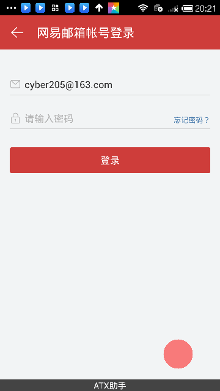

# AutomatorX (atx) (中文版)
[](https://travis-ci.org/NetEaseGame/AutomatorX)
[](http://atx.readthedocs.org/en/latest/?badge=latest)
[](https://pypi.python.org/pypi/atx)
[]()
[](https://gitter.im/codeskyblue/AutomatorX?utm_source=badge&utm_medium=badge&utm_campaign=pr-badge)

## 简介
该项目是为了让手机应用的一些常规测试可以自动化起来，让测试人员摆脱那些枯燥的重复性工作。
基于OpenCV的图像识别技术，有点类似于SikuliX(这东西挺好用的，只是没说要支持手机端)

This project is to make mobile test automated, free people from the boring of repeated job. **AutomatorX** is a python library base on `python-opencv` and a lot of outstanding python libs.

ATX is short for _AutomatorX_

If you are new to atx, it better to start from _Quick start tutorial_ or just view [API documentation link](docs/API.md)

## Features
1. 完全的黑盒测试框架，无需知道项目代码，非侵入式
1. 支持iOS, Android的自动化测试，两个平台都支持测试第三方应用
1. 对于iOS的真机,安卓模拟器都能很好的支持
1. 可以用来测试Windows应用
1. 对于游戏的测试使用了图像识别
1. 同一个测试脚本可以通过图像的缩放算法，适配到其他分辨率的手机上



## Discuss (讨论群)
面向游戏行业测试人员，当然也开放给国际友人(PS：中文不知道他们看得懂不)

- [Gitter Chat Room](https://gitter.im/codeskyblue/AutomatorX?utm_source=badge&utm_medium=badge&utm_campaign=pr-badge)
- QQ: `497460177` PS: 因为我们公司上不了QQ, 所以不会经常上
- 网易内部用户目前请直接联系 `hzsunshx` 或加群 `1347390`

## 限制
- 支持Python2的测试脚本(实验性的支持python3)
- Android 4.1+
- iOS 9.0+
- iOS测试必须要有一个Mac

## Installation
1. 安装ATX

	```
	pip install --upgrade --pre atx
	pip install opencv_python
	```

	为了加快下载速度，国内用户可以使用额外的pip参数`-i https://pypi.doubanio.com/simple/`

	装完之后用命令行简单测试下安装是否成功

	- `python -m atx version` 查看atx版本号
	- `python -m atx doctor` 检查环境配置是否正常

1. Android测试依赖

	安装[ATX手机助手.apk](https://o8oookdsx.qnssl.com/atx-assistant-1.0.4.apk)到手机, 或者手机连接到电脑上用命令行安装 `python -m atx install atx-assistant`

	该App为自动化提供了输入法的功能，屏幕常量等功能

1. iOS测试依赖

	你的iPhone手机需要连接到Mac上，然后Mac安装[WebDriverAgent](https://github.com/facebook/WebDriverAgent)，通常对Xcode部署的人搭WDA的人会遇到不少问题，搞不定继续参考这里 <https://testerhome.com/topics/7220>

	WDA成功启动后，会生成一个用于ATX连接的http地址，比如`http://localhost:8100`
	
1. 额外补充的信息

	- [Win安装](https://github.com/NetEase/AutomatorX/wiki/Win-Installation)
	- [Mac安装](https://github.com/NetEase/AutomatorX/wiki/Mac-installation)


## Getting Started
* To get started, it is better to look at the [QUICK START](docs/QUICKSTART.md)
* More about the ATX [API HERE](docs/API.md)
* iOS的接口文档被放到了testerhome上 <https://testerhome.com/topics/7204>

There is also a doc for professional users. [API ADVANCED](README_ADVANCED.md)

## Command Line Tools
There are a lot of command tools along with atx, eg

* Screenshot
* Screenrecord
* Install minicap to android
* Apk file parser
* Show phone info with JSON
* Enable iPhone developer mode

etc... To see the whole list click [here](https://github.com/NetEase/AutomatorX/wiki/Command-Line-Tools)

## Known Issues
If you are having some issues please checkout [wiki](https://github.com/NetEase/AutomatorX/wiki/Common-Issues) first.

为了避免潜在的Python编码问题，代码文件都应该用UTF-8编码格式保存。

- 对于python2.7 字符串前应该加上u开头，例如`u'你好'`

	文件的开头可以加上下面这段代码，强制使用python3的编码体系(默认全部都是unicode)

	```python
	from __future__ import unicode_literals
	```

- 对于python3的非windows系统
	
	检查一下`sys.stdout.encoding`的编码是否是UTF-8，不然中文字符的输出通常会有问题
	解决办法通常就是在bashrc文件中加入一行

	```shell
	export PYTHONIOENCODING=UTF-8
	```

## ATX Extentions
该部分属于atx的扩展插件实现的功能

插件说明

* [HTML Report](atx/ext/report/README.md)
	
	利用此插件可以在ATX自动化跑完之后，自动生成可以HTML报告，详细记录每一步的执行情况

* Performance record (For Android)
	
	性能测试直接使用了腾讯开源的[GT](http://gt.qq.com/)

	PS: 刚写好没多久，你只能在最新的开发版中看到。有可能以后还会修改。

	使用方法

	1. 首先需要去腾讯GT的主页上，将GT安装到手机上

		<http://gt.qq.com>

	2. 代码中引入GT扩展

		```python
		import atx
		from atx.ext.gt import GT


		d = atx.connect()

		gt = GT(d)
		gt.start_test('com.netease.my') # start test
		# ... do click touch test ...
		gt.stop_and_save()
		```

	3. 运行完测试后，代码会保存到`/sdcard/GT/GW/`+`包名(com.netease.my)`目录下，直接使用`adb pull`下载下来并解析

		```
		$ adb pull /sdcard/GT/GW/com.netease.my/
		```

	该部分代码位于 [atx/ext/gt.py](atx/ext/gt.py), 这部分代码目前在我看来，易用性一般般，希望使用者能根据具体情况，进行修改，如果是修改具有通用性，欢迎提交PR，我们会负责Review代码。

* WebView

	目前仅限安卓, 具体参考 <https://testerhome.com/topics/7232>

	例子代码

	```python
	# coding: utf-8
	import atx
	from atx.ext.chromedriver import ChromeDriver

    d = atx.connect()
    driver = ChromeDriver(d).driver() # return selenium.driver instance
    elem = driver.find_element_by_link_text(u"登录")
    elem.click()
    driver.quit()
    ```

    PS: 实现这个扩展并不复杂，简单的封装了一下selenium就搞定了

## 代码导读
`connect` 函数负责根据平台返回相应的类(AndroidDevice or IOSDevice)

图像识别依赖于另一个库 [aircv](https://github.com/netease/aircv), 虽然这个库还不怎么稳定，也还凑合能用吧

每个平台相关的库都放到了 目录 `atx/device`下，公用的方法在`atx/device/device_mixin.py`里实现。第三方扩展位于`atx/ext`目录下。

## 相关的项目
1. 基于opencv的图像识别库 <https://github.com/netease/aircv>
2. 感谢作者 <https://github.com/xiaocong> 提供的uiautomator的python封装，相关项目已经fork到了

	- <https://github.com/codeskyblue/android-uiautomator-server>
	- <https://github.com/codeskyblue/atx-uiautomator>
3. Android input method <https://github.com/macacajs/android-unicode>
3. SikuliX <http://sikulix-2014.readthedocs.org/en/latest/index.html>
4. Blockly <https://github.com/codeskyblue/blockly>

## Articles
1. [让adb install显示进度](https://testerhome.com/topics/4772)
2. [Android 屏幕同步和录制工具](https://testerhome.com/topics/5006)
3. [安卓手机的快速截图](https://testerhome.com/topics/5004)
4. 更多的系列文章 <https://testerhome.com/topics/node78>

## Developer dashboards
1. Platform Versions, Screen Size, Open GL Version <http://developer.android.com/intl/zh-cn/about/dashboards/index.html>

## Contribution
如何才能让软件变的更好，这其中也一定需要你的参与才行，发现问题去在github提个issue, 一定会有相应的开发人员看到并处理的。文档有错误的话，直接提Issue，或者提PR都可以。
由于我平常使用该项目的概率并不怎么高，所有不少问题即使存在我也不会发现，请养成看到问题提Issue的习惯，所有的Issue我都会去处理的，即使当时处理不了，等技术成熟了，我还是会处理。但是如果不提交Issue，说不定我真的会忘掉。

BTW: 有开发能力的也可以先跟开发者讨论下想贡献的内容，并提相应的PR由开发人员审核。

## License
This project is under the Apache 2.0 License. See the [LICENSE](LICENSE) file for the full license text.

