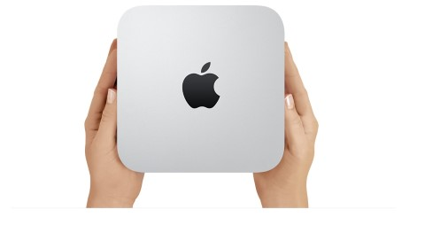

## iOS Automation
iOS因为其管理的严格以及文档的困乏，使得其自动化实施起来困难重重。然而iOS的市场占有率又这么高，所以也只能硬着头皮去读Apple网站下一堆晦涩的文档，一边摸索，一边记录。


## 相关工具安装
毕竟iPhone是苹果的产品，所以搞iOS测试还是得有台苹果电脑的好。
推荐MacMini



先安装 brew, 如何安装参考 <http://brew.sh>

```
$ brew install libmobiledevice # required
$ brew install homebrew/fuse/ifuse # optional

$ brew install node # skip if you already have node or nvm installed.
$ npm i -g ios-deploy
```


安装工具用于解析ipa包

```
$ pip install pyipa
```

## FAQ
- How to keep iPhone screen on ?

	1. 通用/自动锁定 改成**永不**
	1. 显示与亮度 调到最低

- 其他90%的问题

	1. 重启iPhone
	1. 重启Mac
	1. 更新XCode

- How to know my udid
	
	<http://whatsmyudid.com/>

## 限制的地方
- 除非使用第三方输入法，否则只能对开发者签名的应用有效，其他的App都会陷入长时间的等待
- 输入法只能使用系统自带的输入法
- 点击不受限制，可以将应用转移到后台，然后直接完成点击

## Articles
- [2012年的文章关于UIAutomation, 4年的时间也没有让它褪色](http://blog.manbolo.com/2012/04/08/ios-automated-tests-with-uiautomation)

## Authors
codeskyblue@gmail.com 2016.06