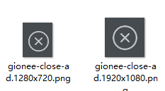

# API
接口也可以参考sphinx自动生成文档
[Documentation on ReadTheDocs](http://atx.readthedocs.org/en/latest/?badge=latest)


## Initial android device connect (Only Android)

```py
import atx

d = atx.connect()
```

通过设置相应的环境变量也可以设置连接参数，用来方便持续集成

目前支持4个环境变量

```sh
ATX_ADB_SERIALNO
ATX_ADB_HOST
ATX_ADB_PORT
ATX_PLATFORM  默认是 android
```

```sh
$ python -c 'import atx; atx.connect("EFF153")'

# 等价写法
$ export ATX_ADB_SERIALNO="EFF153"
$ python -c 'import atx; atx.connect()'
```

## App start and stop

```py
package_name = 'com.example.game'

d.stop_app(package_name)

# d.stop_app(package_name, clear=True) # stop and remove app data (only Android)
d.start_app(package_name)
```

## Execute shell command (Only Android)
	
```py
d.adb_cmd(['pull', '/data/local/tmp/hi.txt']) # default timeout 30s, use timeout=None to set unlimited time
d.adb_shell(['uptime'])

# forward device port to localhost
# same as 
# adb forward tcp:$(randomPort) tcp:10080
# Expect: (host, port)
print d.forward(10080)

print d.wlan_ip # 获取手机的Wlan IP

print d.current_app() # 获取当前运行应用的package name和activity以及运行的pid
# Expect: AppInfo(package='com.miui.mihome2', activity='com.android.launcher2.Launcher', pid=634)
```

## 图片查找与点击

```py
# find image position
if d.exists('button.png'): # 判断截图是否在屏幕中出现, 反馈查找到的坐标
	print 'founded'

# take screenshot
d.screenshot('screen.1920x1080.png') # Save screenshot as file

# click position
d.click(50, 100) # 模拟点击 x, y

# long click
d.long_click(50, 100) # only works on android for now
```

## click_image函数

```py
# click image, if "button.png" not found, exception will be raise.
d.click_image("button.png")

# add description (also used for report generate)
d.click_image("button.png", desc="I love click")

# click image, if "button.png" not found, will return None
d.click_image("button.png", safe=True)

# click image with long click
d.click_image("button.png", action='long_click')

# 不等待的图片点击, 如果图片不存在直接返回None
d.click_nowait('button.png')

# 文件名添加截图手机的分辨率, 脚本运行在其他分辨率的手机上时可以自动适应
d.click_image("button.1920x1080.png")
```

## 多分辨率适配
```
# 下面这种方法会自动根据当前测试手机的分辨率选择合适的文件
# 比如手机分辨率1920x1080,代码会自动寻找文件4中文件之一，找到就返回
# - button@1920x1080.png
# - button@1080x1920.png
# - button.1920x1080.png
# - button.1080x1920.png
d.click_image("button@auto.png")
```

比如下面这张图


点击这个按钮用这种方法就好 `d.click_image("gionee-close-ad@auto.png")`

关于为什么同时出现用`@`和`.`分隔，一开始用的是pytk写的编辑器，那个tkFileDialog对`@`支持的不好，所以只能用`.`

## 偏移量以及范围限制

```
# 文件名中添加偏移量, 格式为 <L|R><number><T|B><number>.png
# 其中 L: Left, R: Right, T: Top, B: Bottom
# number为百分比
# 所以 R20T50代表，点击为止从图片中心向右偏移20%并且向上偏移50%
d.click_image("button.R20T50.png")
# same as
d.click_image("button.png", offset=(0.2, -0.5))

# Full example
# param: delay is when image found wait for a moment then click
d.click_image("button.png", 
	offset=(0.2, 0.5), 
	action="long_click", 
	safe=True, 
	desc="I love click", 
	method='template', 
	threshold=0.8,
	delay=2.0)

# if image not show in 10s, ImageNotFoundError will raised
try:
	d.click_image('button.png', timeout=10.0)
except atx.ImageNotFoundError:
	print('Image not found')

# 在特定的区域内查找匹配的图像(IDE暂时还不支持如此高级的操作)
nd = d.region(atx.Bounds(50, 50, 180, 300))
print nd.match('folder.png')
```

## 锁定当前屏幕（主要用于提高查询效率）
```
d.keep_screen()
d.click_nowait("button1.png")
d.click_nowait("button2.png")
d.free_screen()
```

这种操作，执行第二次`click_nowait`时，就不会再次截图。另外上面的代码也可以这样写

```
with d.keep_screen():
	d.click_nowait("button1.png")
	d.click_nowait("button2.png")
```

## 图片等待操作
```
d.wait("button.png") # 等待一个按钮出现
d.wait_gone("button.png") # 等待一个按钮消失
```

## 原生UI操作
下面给的例子并不完全，更多的接口需要看下面这两个链接

- Android 如何点击UI元素请直接看 <https://github.com/codeskyblue/atx-uiautomator>
- iOS如何点击UI元素参考 <https://github.com/codeskyblue/python-wda>

里面的API是直接通过继承的方式支持的。

```py
# click by UI component
d(text='Enter').click()
d(text='Enter').sibling(className='android.widget.ImageView').click() # only android

# swipe from (sx, sy) to (ex, ey)
d.swipe(sx, sy, ex, ey)
# swipe from (sx, sy) to (ex, ey) with 10 steps
d.swipe(sx, sy, ex, ey, steps=10)

## 文本的输入 (only Android)

```py
d.type("hello world")
d.type("atx", enter=True) # perform enter after input
d.type("atx", next=True) # jump to next after input
d.clear_text() # clear input
```

## Common settings
	
```py
# 配置截图图片的手机分辨率
d.resolution = (1920, 1080)
print d.resolution
# expect output: (1080, 1920) 实际获取到的值会把小的放在前面

# this is default (first check minicap and then check uiautomator)
d.screenshot_method = atx.SCREENSHOT_METHOD_AUTO # 默认
# d.screenshot_method = atx.SCREENSHOT_METHOD_UIAUTOMATOR # 可选
# d.screenshot_method = atx.SCREENSHOT_METHOD_MINICAP # 可选

d.image_match_method = atx.IMAGE_MATCH_METHOD_TMPL # 模版匹配, 默认
# d.image_match_method = atx.IMAGE_MATCH_METHOD_SIFT # 特征点匹配, 可选

# d.image_match_threshold = 0.8 # 默认(模版匹配相似度)

d.rotation = None # default auto detect, 这个配置一下比较好，自动识别有时候识别不出来
# 0: home key bottom(normal)
# 1: home key right
# 2: home key top
# 3: home key left
```


## 监控事件 (已经废弃，不建议使用)

watch是一个内部循环，对于on函数中的所有出现的图片进行监控，如果发现吻合的，就执行后续的操作，直到timeout时间到。

下面的这个例子，效果为 当出现`notification.png`就点击`confirm.png`图片，只有检查的顺序，并没有执行的顺序。需要注意的是需要在timeout超时之前，执行`quit`函数

```py
# watcher, trigger when screenshot is called
def foo(event):
	print 'It happens', event
	d.click(*event.pos)

timeout = 50.0 # 50s
with d.watch(timeout=timeout) as w:
	w.on('enter-game.png').click()
	w.on('notification.png').on('npc.png').click('confirm.png')
	w.on('inside.png').quit().quit()
	w.on_ui(text='Login').quit() # UI Component
	w.on('outside.png').do(foo)

# will not raise errors(TODO: not working in latest version)
# 'enter game' is just a name which will seen in debug log
with d.watch('enter game', timeout, raise_errors=False) as w:
	w.on('output.png').click()
```	

## events函数调用事件

```py
def my_listener(event):
	print 'out:', event

d.add_listener(my_listener, atx.EVENT_SCREENSHOT)
d.screenshot()

# expect output:
# out: HookEvent(flag=8, args=(), kwargs={})
```
