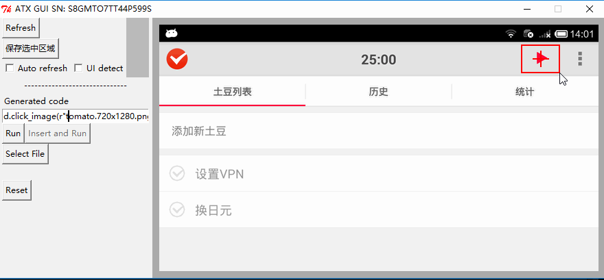

# Quick start

For Android and iOS


## Connect an device

* Android

	Android phone (`sdk>=4.1`) to PC

	Open terminal, execute `adb devices`, make sure you see your device.

	```bash
	$ adb devices
	List of devices attached
	EP7333W7XB      device
	```

	创建一个python文件 `test.py`, 内容如下

	```python
	# coding: utf-8
	import atx

	d = atx.connect() # 如果多个手机连接电脑，则需要填入对应的设备号
	d.screenshot('screen.png') # 截图
	```

	运行 `python test.py`

* iOS

	WDA运行完之后，准备好`DEVICE_URL`, 如 `http://localhost:8100`
如果是真机，需要将localhost改成手机的IP地址

	python代码可以这样写

	```python
	# coding: utf-8
	import atx

	d = atx.connect('http://localhost:8100', platform='ios') # platform也可以不指定
	print d.status()
	```

## Take screenshot

- Android: `python -m atx gui`
- iOS: `python -m atx gui --serial $DEVICE_URL`

`DEVICE_URL` 通常是 `http://localhost:8100`

更多命令可以通过`python -m atx gui --help` 查看。如果屏幕超过了整个屏幕可以通过调小 `--scale` 来调整

鼠标左键拖拽选择一个按钮或者图标, 按下`Save Cropped`截图保存退出. (按下`Refresh`可以重新刷新屏幕)



_PS: 这里其实有个好的IDE截图的最好了，现在是用Tkinter做的，比较简洁，但是可以跨平台，效果也还可以_

截图后的文件另存为 `button.png`, `test.py` 最后增加一行 `d.click_image('button.png')`

重新运行 `python test.py`, 此时差不多可以看到代码可以点击那个按钮了

## 编辑器
另外还有一个好用的WEB编辑器，完全独立的本地服务，名叫`atx-webide`

虽然简陋，但已经非常好用。代码编辑，截图，测试运行都包含在内。

安装方法

```
pip install -U --pre atx-webide
```

在命令行下使用命令 `python -m atxweb` 启动编辑器

## 更多

	可以使用的接口还有很多，回到README继续看
